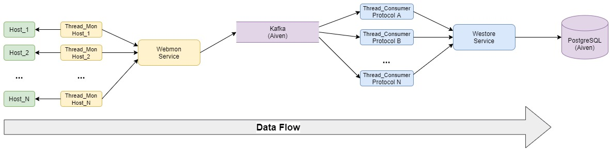

# tabajaraWebmon


[](https://opensource.org/licenses/mit-license.php) 

## Contents
1. [Introduction](#introduction)
2. [Requirements](#requirements)
3. [System Design](#system-design)
4. [Running](#running)
5. [Features Not Implemented Yet](#Features-Not-Implemented-Yet)
6. [How to Contribute](#how-to-contribute)

## Introduction

This repository contains Tabajara Webmon's code. It is a webmonitor tool
that checks a set of basic metrics of a given URL and also monitors the 
occurencies of a regular expression (regex). It is designed to handle several
URLs and to be extensible to different application protocols (not only HTTP).


## Requirements

This session describes Tabajara Webmon's main requirements.

### Functional Requirements
* User should be able to add URLs to monitor
* User should be able to specify to monitor a specific regular expression

### Non-Functional Requirements
* Reliable - system cannot lose monitoring data
* Scalable - should be able to add more monitoring nodes to the system without
effort

## System Design
This system is split in two services that can be run independently. The first
service, named **Webmon** is responsible to gather monitoring data from remote
hosts. The second service, called **Webstore** is responsible to consume the data
stored in Kafka and store it in a SQL Database (PostgreSQL) - both services,
kafka and the database, are hosted by [Aiven](https://aiven.io/).

The overall design is presented in Figure below. It contains the dataflow and
how services interact with services hosted at [Aiven](https://aiven.io/).



### Webmon Service (Monitoring Service)
This service was developed to monitor several hosts at same time, for each host 
defined in `config.conf` file a thread is created and starts to monitor the 
host accordingly. Also, the multi thread model allows the monitoring 
customization of each host, with different probe frequency, for example and
allows the system to scale easily, if needed.


Also, it is important to note that, initially, this service was implemented to 
handle only HTTP protocol probes. However, adding a new protocol (i.e. SMTP) 
should be an easy process. 


### Webstore Service (Consumer Service)
This service is responsible to consume monitoring data, stored into a kafka
topic. In order to improve the performance and facilitate the scalability of
this service, for each Kafka topic a thread is created. For instance, each Kafka
topic should different protocol, however, it is not a strong constraint and
a second topic (i.e. http_topic_2) could be added to handle http probes if 
a huge number of hosts start to be monitored.

This service can be extended to store the messages in other durable storages. 
This initial implementation can store in a local file (for debug purposes) or
in a remote PostgreSQL service, hosted at [Aiven](https://aiven.io/).


## Running

### Premisses
The tabajaraWebmon project automates most part of the system. However, since there
are some remote parts, hosted at [Aiven](https://aiven.io/), the user still has
to download and configure properly the access files and perform some manual steps.
Before running Webmon and Webstore, remote services and authentication data (uri,
ssl file, etc) must be already available.

* Kafka instance running with a topic named `http_monitor`;
* PostgreSQL instance running with a database and tables in place. To create 
tables you can use the script [create_pg_tables.py](webstore/create_pg_tables.py).
  

As mentioned earlier our repository contains two services, the [Webmon Service](/webmon/)
service which contains the monitoring service and feeds a Kafka instance and the
[Webstore Service](/webstore/) service that consumes messages in kafka and store
it in a PostgreSQL database. Each service contains a configuration file that should
be filled before run the services. 

Steps and commands to run the services are:

1. Copy the `config_example.json` file to `config.json`

```bash
cd webmon/
cp -p config_example.json config.json
cd ..

cd webstore/
cp -p config_example.json config.json
```

2. Download the `ssl_cafile`, `ssl_certfile` and `ssl_keyfile` from [Aiven Console](https://console.aiven.io)
and place it inside `certificates/` directory.
   

3. Fill the `config.json` file with the proper information. Basically, you have to
fill it with information related to connection to the Aiven services.

   
3.1. The configuration file related to the service `Webmon` also contains parameters
to the Host you want to monitor. These parameters are:

```
"HOSTS": {
    "[hostname or IP address]": {
    "PROTO": "HTTP",        <- Application protocol used to monitor the service.
    "FREQUENCY": "10",      <- Probe Frequency (in seconds).
    "REGEX_MON": ["open *"] <- Regex list to match, use python regex format.
  }
```

4. Build docker containers:

```bash
docker-compose build
```

5. Run the services. *Note that when the service is running the terminal 
will be blocked, so each command must be run in different terminals.*

```bash
docker-compose run webmon
docker-compose run webstore
```

### Running Tests
Since this repository contains two independent services, each one has its own
unit tests.

Running Webmon Tests:

```bash
cd webmon/
python -m unittest
```

Running Webstore Tests:

```bash
cd webstore/
python -m unittest
```


## Features Not Implemented Yet

Our Tabajara Webmon already has several cool features, however we are looking
forward to add more cool features. This session list some features that we
would like to add, in short-term, to Tabajara Webmon.
If you want to help us, refer to the session [How to Contribute](#how-to-contribute)
to send your Pull Request.

### Logging
The logging feature is an important feature to add to Tabajara Webmon to help
users to identify problems and crashes.

### Integration Tests
This initial version we implemented just unit tests. However, it would be nice
to add some integration tests to the system.

### Remote Services Automation
Creating the Kafka and PostgreSQL services at [Aiven](https://aiven.io/) can be 
automated by its CLI, API or Terraform ([Aiven's Doc](https://help.aiven.io/en/articles/493424-i-d-like-to-automate-something-using-aiven-is-there-an-api-for-this)).
In this version we provide a python script to create the initial tables and used
docker instances to create services, but some manual work is still necessary. 


## How to Contribute
First step, contact us to make sure the feature or the issue you want to fix 
is not being implemented by others and to present yourself to us. Traditionally,
the steps to contribute to any open source project are:

Step 1: Sign into GitHub.

Step 2: Fork our project repository.

Step 3: Clone your fork.

Step 4: Navigate to your local repository. ...

Step 5: Check that your fork is the "origin" remote. 

Step 6: Add the project repository as the "upstream" remote.
